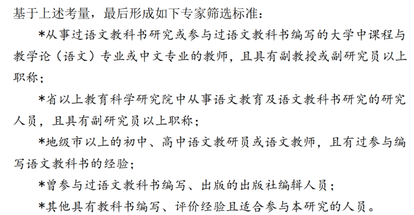
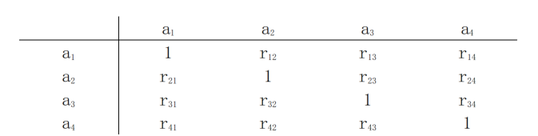

## 德尔菲分析方法是什么？
德尔菲法（Delphi Method），是 20 世纪 70 年代由美国兰德公司（Rand Corporation）提出的一种用于做出决策和反馈的匿名函询的方法，因主要邀请相关领域的专家参与意见的征询，因此又可称为专家意见法。目前，德尔菲法广泛应用于军事、医学、商业、教育等多种研究领域。

德尔菲法实质上属于一种问卷调查的方法。该方法背后的基本假设是，在对某一问题作出主观判断时，专家的智慧要好于普通人的智慧，而若干专家的智慧要好于一个专家的智慧。因此，使用德尔菲法可以最为有效的利用专家意见、促进结论的形成。而在教育领域，德尔菲法主要用于教育评价工具的建构和开发的研究。

作为一种主观、定性的研究方法，其最大特点在于就某一问题“达成共识”。因此，德尔菲法可用于确定或设计计划或者方案；探索和解释引发不同判断的基本假设；找出使群体成员达成共识的信息；当然，它更多被应用于有关成果等第的评选和评价指标体系的确定和权重的划定等研究。故德尔菲法“在某种程度上就是决策制定过程。”而这一点从国内外的相关研究成果中可得到印证。在教科书研究领域，德尔菲法主要运用于制定教科书评价指标体系。使用该研究方法的过程就是将研究者拟订出的评价指标体系初稿送交相关专家进行审核，通过大约两轮或以上的意见征询后，实现“从不同方面或多个角度来对教科书质量进行评价，构建教科书质量评价指标体系。”

具体而言，首先要将相关问题以问卷的形式发放给专家，在获得专家意见之后，对每位专家反馈的意见进行整理、归纳、统计，然后据此修订研究中的相关内容和调查问卷，然后再将修改后的问卷和前一轮各位专家的意见再提供给邀请的专家，再次征求他们的意见；不断重复该过程，直至所得结果满意为止。

例如在文献1中，作者在修正指标阶段，基于社会科学领域的德尔菲法邀请了20名专家对上一阶段形成指标体系的合理性进行了三轮专家意见征询，并依据专家反馈的意见对初拟的指标进行修正，最终形成较为满意的评价指标体系；然后再邀请专家们就各评价维度和指标的重要性程度做出评判，并运用层次分析法形成整套教科书评价指标体系的权重。

## 德尔菲方法的特点
其一，不需要集中专家。德尔菲法从一开始的设计就是通过函询的方式向分布在不同地域的专家征询意见，既免去专家的奔波之苦，也免去了研究者因需要承担专家们数额不菲的交通费用而减少或降低参与研究的专家的门槛。

其二，具有匿名性。由于德尔菲法采用的是邮件函询的形式，所以参加研究的各位专家彼此之间非但不会碰面，而且多数情况下也不知道还有谁会参与研究，这样就可以消除权威的影响，使各种不同的观点得到充分的表达；这也是德尔菲最重要的特征之一。

其三，在多轮反馈中实现迭代。应用德尔菲法开展研究一般要经过三轮到四轮的意见征询过程，且每一轮的意见征询都是不断修正研究中的观点，实现迭代的过程。(在小论文里一般都是两轮即可)

## 专家选定标准
一是专家尽可能做到“广泛化”，二是专家要注重“精深化”，三是专家要有参与意愿，需要在向专家发出正式邀请前明确了解专家是否对本研究感兴趣、是否愿意参与本研究的多轮意见征询等

 

专家人数一般为20人，大多数关于德尔菲法的介绍性书籍中建议使用该方法时，专家的人数一般不需超过20人。默里·托洛夫（Murray Turoff，1970)在讨论德尔菲法使用时，提出，当一个人要在有限的时间内掌握20人或20多人的观点并形成他们之间意见自由的交换时，是颇费时间的。费利西蒂·哈森和辛纳德·基尼（Felicity Hasson & Sinead Keeney，2011）的研究中认为，当参与研究的专家人数达到13人时，研究的结论会趋于一个收益的递减点，再增加参与的人数就会降低其可靠性。

## 多轮函询流程
- 1️⃣ 第一轮意见征询的问卷设计
    第一轮意见征询的问卷主要包括三大部分，问卷编写说明、专家基本信息收集和评价指标意见征询。
    - 其一，问卷编写说明。该部分是用于向专家说明本研究的目的、教科书评价参考框架的构成、问卷主体部分的构成、填写方法以及专家的权利和义务等相关信息。
    - 其二，专家基本信息收集。由于德尔菲法是高度依赖于专家个人素质和水平的研究方法，所以专家所从事的研究领域和对研究内容的熟知程度将直接影响到本研究的的可靠程度。为此，笔者在第一轮问卷中设计了收集专家基本信息的题目，用于了解专家所从事与教科书研究的基本情况以及对教科书评价研究的熟知程度，以保证所邀请专家对评价维度和指标提出的修改意见是权威可靠的。所以收集的信息如下：

    - 其三，评价指标意见征询。该部分是本问卷的主体部分，具体包括对评价维度、子维度设置合宜性的评判和对评价指标合宜性的评判。每一维度、子维度或指标为一题；每题的判断选项包括“非常适合”“适合”“比较适合”“无意见/不确定”“不太适合”“不适合”“很不适合”共七项，分别赋予7分到1分，每题为单选；每题后留有供专家填写意见和建议的位置。

- 2️⃣ 第二轮、第三轮的意见函询问卷设计
    - 第二、三轮意见征询的问卷要在前一轮专家意见反馈的基础上修订。由于参与后两轮意见征询的专家都来自参与了第一轮意见征询的专家，所以，在问卷的设置上简化问卷的说明部分，也不再收集除专家姓名外的其他个人信息；但仍注明问卷返回时间、问卷构成基本说明、知情同意过程等必要信息。
    - 有所不同的是，增加评价指标修改情况及上轮意见集中程度反馈。运用德尔菲法时，后一轮意见征询要基于前一轮意见征询的结果开展，这就要求在后几轮的问卷中要向专家择要说明本轮问卷中的评价维度、评价指标与上一轮有何变化；同时以平均分、标准差等相关数据向专家们告知上一轮意见征询中专家意见的集中程度。以便专家在了解前一轮整体意见及修订情况后对本轮问卷中的评价维度、指标的合理性做出判断。

## 数据处理
### 专家基本信息及权威性
- 1️⃣ 专家的积极程度
    专家的积极程度一般以问卷回收率和意见提出率作为考核的指标。
    - 问卷回收率是指有效回收的问卷占总发出问卷的比例。
    - 问卷意见提出率是指提出意见的专家在所有专家中的比例。
- 2️⃣ 专家的权威系数
    专家的权威系数（Cr）是对专家在某一问题或方向上的权威水平的评判。专家权威系数的数据来源于专家的自我汇报和评价，通常是由专家回答问题的依据（Ca）与其对该问题的熟知程度（Cs）两个因素决定。参与研究的专家基于自我判断的方式填写第一轮问卷中专家基本信息中的有关问题，笔者依据专家的回答的结果对专家的权威程度做出判断。相关研究显示，专家对评价指标合理性判断的准确程度是随专家的权威系数的提高而提高的。专家权威系数的计算公式为 Cr=（Ca+Cs）/ 2。学界一般对专家权威程度的接受度是 Cr≥0.7。其中专家回答问题的依据（Ca）和专家对问题的熟知程度（Cs）的内涵做如下解释。
    - 专家回答问题的依据（Ca）
        专家回答问题的依据（Ca）=（工作单位得分+所从事与教科书有关的领域得分+从事该领域工作年限得分+评判本研究各项指标的依据得分）/4
    - 专家对问题的熟知程度（Cs）
        专家对调查内容的熟知程度（Cs）是另一影响专家的权威系数的因素。本研究将专家对问题的熟知程度从很熟悉到很不熟悉分为五个级别，各级别间赋分分值相差为 0.25。五个级别及对应赋分分值见下表。
### 专家意见协调程度和集中程度分析
对回收的第一至三轮专家意见征询的结果进行数据处理时，主要通过计算专家意见的协调程度判断各位专家意见是否具有分歧；通过计算专家反馈意见的得分均值和专家意见的变异系数来对专家意见的集中程度进行判断，以此作为判定是否修改已拟订的维度、子维度和评价指标的依据。一般来说，相关研究中经常使用肯德尔协调系数（W，Kendall's W）和变异系数(Cv)。
- 1️⃣ 肯德尔协调系数
    肯德尔协调系数（W）是一种非参数检验方法，是对由 n 个评委对 x 个评价对象或指标进行评判，然后检验 n 个评委间评价的结果是否具有一致性。一般地，肯德尔协调系数的取值范围是[0，1]，得到的结果越接近 1 时，说明专家们给出的意见的集中程度越高。同时，在计算专家间肯德尔协调系数的同时，还需要对专家意见的一致性程度的可信度（Chi-Square）进行检验，当 p 值越接近 0.00，说明所得结果的信度也就越高。（⚠ 注意，这里要与弗里斯系数（Fleiss's Kappa）区分开，适用于多个评委对多个项目进行分类或划分为某些类别（如“好”或“坏”，“通过”或“未通过”）的情况，用来评估这些评委在分配类别上的一致性。）
- 2️⃣ 变异系数
    变异系数(Cv)是参与意见征询的所有专家对本研究提出的评价指标合宜性评判结果的一致性程度。变异系数是数据的标准差和均值的比值。当计算结果越接近100%，就说明专家间的协调程度越高。一些研究者认为变异系数应该小于30%，若大于这一数值则意味着评价对象或指标存在较大的问题或风险，应该被删除。

        - 当变异系数小于15%时，该指标可以被保留，进入下一个环节；
        - 当变异系数大于15%但小于30%，该指标需要进行修改；
        - 当变异系数大于30%，则将该指标从评价指标体系体系中删除。

最后要注意的是，收集专家轮数过多时需要进行**重测信度**检验：
由于研究要进行多轮专家意见征询，前后轮次之间不可避免的存在一些相同的指标要经受同一专家多次的评审，这就要求对两轮评审的结果进行重测信度（test-retest reliability）的分析，以检验专家意见是否具有稳定性。该过程可借助问卷星提供的SPSSAU计算平台中的相关分析实现。

### 维度及指标的重要性评判（层次分析法）
最后一轮专家意见征询的主要目的是邀请专家对指标体系中各维度和指标的重要性进行评判，以此划定它们的权重。在这里可以使用层次分析法处理专家们对各维度和指标给出的权重意见。
- 1️⃣ 构建判断矩阵
    基于层次分析法对专家们的意见进行结果分析时，首先要将所有专家对评价维度和指标两两比较时形成的判断矩阵进行整合。具体做法是，将同一层级结构中的若干评价指标排列成一致性判断矩阵，如指标 a1，a2，a3和 a4，形成的矩阵就是：
    
    在上面这个矩阵中，具有如下属性。首先，对角线上分布的各指标自身的比较，因此数值为1；其次，以${r_{21}}$为例，它表示评价指标${a_{2}}$和评价指标${a_{1}}$之间两两比较时两个指标在重要性程度上的比值。当某位专家认为评价指标 ${a_{2}}$比评价指标${a_{1}}$重要的多，那么${r_{21}}$的值就应该是7。再次，在矩阵的对角线两侧呈倒数关系，所以，${r_{12}}$的值就自然为1/7。
- 2️⃣ 计算权重
    要计算每个元素的权重需要首先将上面构成的矩阵中的每一个评价指标进行标准化。正规化的方法是将矩阵中的每一个评价指标的值除以所在列的所有指标值的和。公式为：
    $$a_{ij}' = \frac{a_{ij}}{\sum_{i=1}^{n} a_{ij}}$$
    将所有评价指标标准化后，就可以得到一个标注化后的新的矩阵。然后再计算标准化后的矩阵中每一列的平均值，进而求得权重值。公式为：
    $$Wk = \frac{ \sum_{i=1}^{n} a'_{ij} }{n}$$
- 3️⃣ 一致性检验
    学界一般使用一致性指标 CI（consistency index），其计算公式如下，
    $$ \text{CI} = \frac{\lambda_{\text{max}} - n}{n - 1} $$
    公式中的$\lambda_{\text{max}}$为最大特征根，它的计算公式为：
    $$ \lambda_{\text{max}} = \sum_{i=1}^{n} \frac{(AW)_i}{nW_i} $$
    其中，${AW}$表示原矩阵与权重的乘积。于是，可以计算出一致性指标的数值。但是，当有很多元素需要判断时，“判断矩阵的规模较大，要保证判断矩阵的一致性显然要更难一些。”因此，还需在一致性指标的基础上引入平均随机一致性指标 RI（random index）。根据不同阶数平均随机一致性指标表，见下表，我们可以计算出一致性比率（CR，即consistency ratio)。一致性比率（CR）的计算公式如下：
    $$ \text{CR} = \frac{\text{CI}}{\text{RI}} $$
    当 CR<0.1 时，就可以认定所得具有了较为满意的一致性；否则，就需进行新一轮的调整和修订。

## 参考的文献
翟志峰.(2021).核心素养视域的中学语文教科书评价指标体系建构(博士学位论文,华东师范大学).博士https://link.cnki.net/doi/10.27149/d.cnki.ghdsu.2021.000388doi:10.27149/d.cnki.ghdsu.2021.000388.
